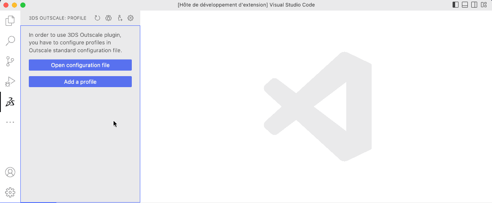
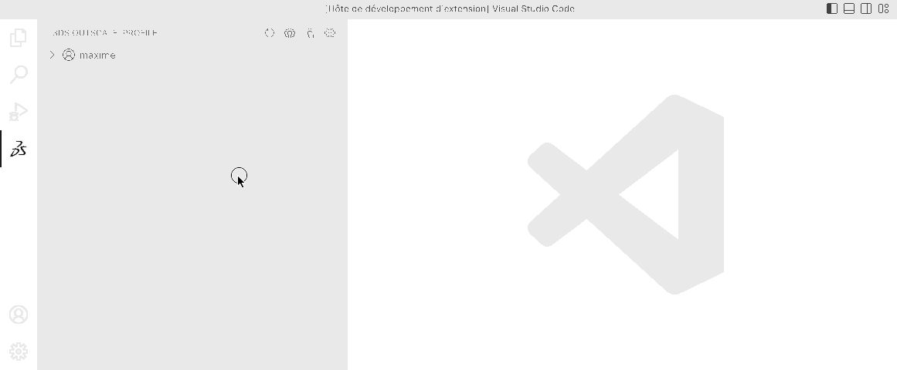
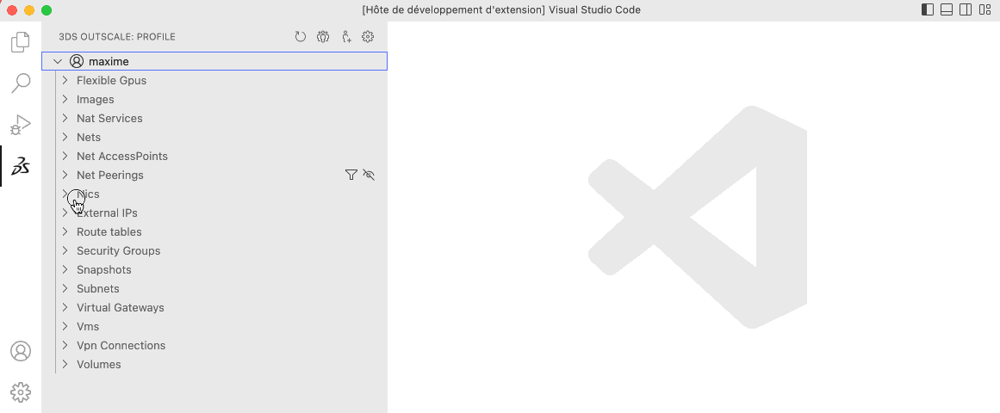
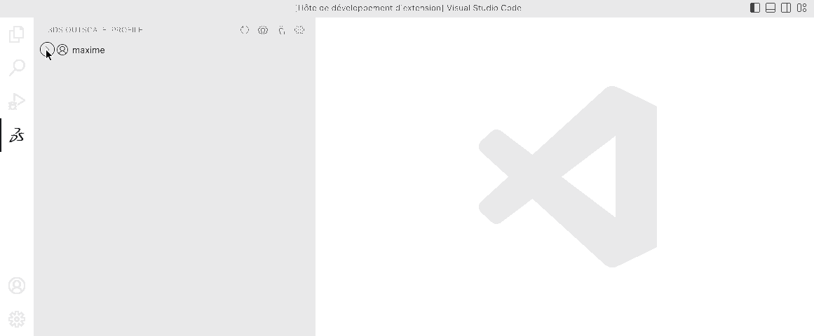
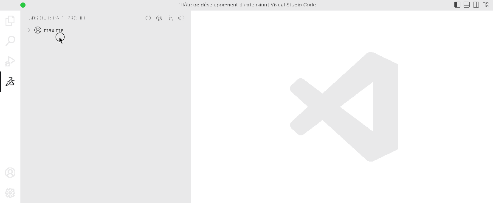
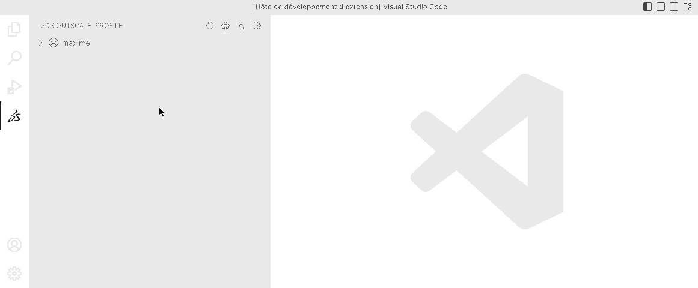
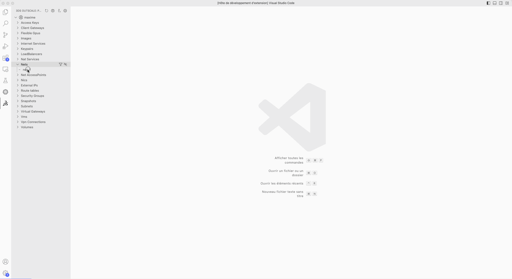

# 3DS Outscale Viewer

This extension provides a vscode integrated viewer of cloud resources. It relies on widely use configuration file (~/.osc/config.json or ~/.osc_sdk/config.json).

## Installation
Open this extension in the  [Visual Studio Marketplace](https://marketplace.visualstudio.com/items?itemName=outscale.osc-viewer)
## What is available ?
### Add profile into configuration file

### Hide resources from the view

### Filter resources from the view

### Show details of a resource 

### Do actions on resources

### Show Console logs of VMs

### (Beta) Show Net view
This feature uses the library [cytoscape](https://github.com/cytoscape/cytoscape.js) and the layout [dagre](https://github.com/cytoscape/cytoscape.js-dagre) to display the Net view. This is a beta feature, do not hesitate to test and give feedbacks.

## Development
See [Development process](./docs/development.md)

## License

> Copyright Outscale SAS
>
> BSD-3-Clause
